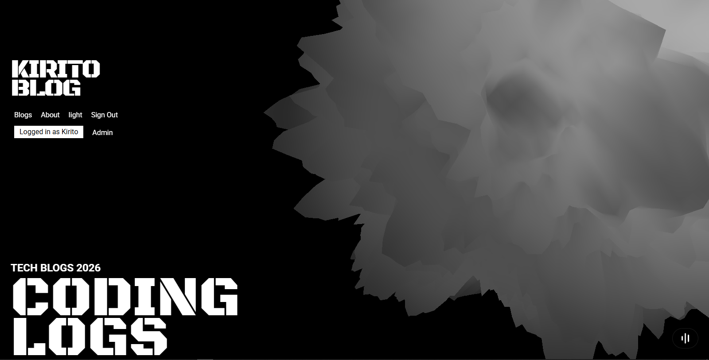
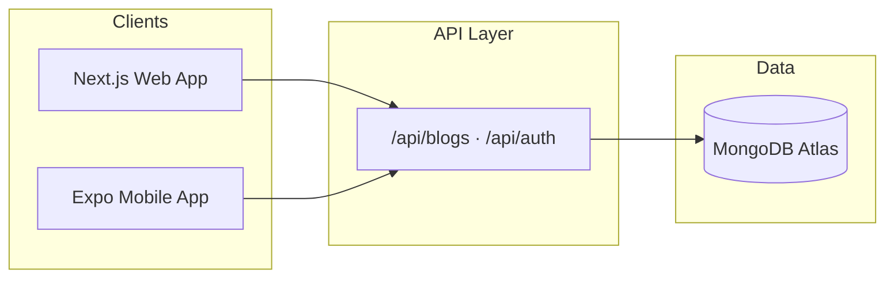

# Kirito Blog

A full-stack technical blog platform with a **Next.js web app** and an **Expo mobile app**, managed as a **pnpm workspace**.

The web app delivers an immersive landing experience with 3D visuals, a public blog, GitHub authentication, and a MongoDB-backed admin dashboard. The mobile app reads from the same REST API and renders posts with NativeWind styling.

**Live demo:** [kirito-blog.vercel.app](https://kirito-blog.vercel.app)

## Preview

<table>
  <tr>
    <td align="center"><strong>Light theme</strong></td>
    <td align="center"><strong>Dark theme</strong></td>
  </tr>
  <tr>
    <td align="center">
      
    </td>
    <td align="center">
      
    </td>
  </tr>
</table>

The landing page features a displacement-sphere 3D hero, GSAP-powered intro animations, custom stencil typography, and a system-aware light/dark theme toggle.

## Highlights

- **Immersive web experience** — Three.js displacement sphere, scroll animations, ambient audio, and route transitions
- **Full blog platform** — Category filters, markdown posts with syntax highlighting, SEO metadata, and static generation for published slugs
- **GitHub authentication** — NextAuth.js v5 sign-in with user sessions stored in MongoDB
- **Admin dashboard** — Create, edit, review, publish, and draft articles; manage users and view platform stats
- **Cross-platform mobile reader** — Expo app for iOS, Android, and web that consumes the deployed API
- **Production-ready tooling** — Shared ESLint flat config, Prettier, Husky pre-commit hooks, and GitHub Actions CI

## Packages

| Package    | Path                  | Description                                                            |
| ---------- | --------------------- | ---------------------------------------------------------------------- |
| **Web**    | [`web/`](./web)       | Next.js 16 App Router site — landing page, blog, admin panel, REST API |
| **Mobile** | [`mobile/`](./mobile) | Expo Router app — blog reader for iOS, Android, and web                |

## Tech Stack

### Web (`web/`)

- [Next.js 16](https://nextjs.org/) (App Router, Turbopack)
- [React 19](https://react.dev/)
- [Tailwind CSS 4](https://tailwindcss.com/)
- [MongoDB](https://www.mongodb.com/) + [Zod](https://zod.dev/) validation
- [NextAuth.js v5](https://authjs.dev/) (GitHub provider)
- [Three.js](https://threejs.org/) / React Three Fiber for 3D visuals
- [GSAP](https://gsap.com/) for animations
- [Shiki](https://shiki.style/) + react-markdown for code blocks

### Mobile (`mobile/`)

- [Expo 54](https://expo.dev/) + [Expo Router](https://docs.expo.dev/router/introduction/)
- [React Native 0.81](https://reactnative.dev/)
- [NativeWind 4](https://www.nativewind.dev/)
- Markdown rendering with syntax highlighting (Shiki)

### Tooling (root)

- [pnpm](https://pnpm.io/) workspaces
- [ESLint 9](https://eslint.org/) flat config (shared base + per-package overrides)
- [Prettier](https://prettier.io/) + [Husky](https://typicode.github.io/husky/) pre-commit hooks

## Architecture



| Route / area    | Purpose                                       |
| --------------- | --------------------------------------------- |
| `/`             | Animated landing page with 3D hero            |
| `/blogs`        | Blog listing with category filters            |
| `/blogs/[slug]` | Individual post (markdown + syntax highlight) |
| `/about`        | About page with timeline and skills grid      |
| `/admin`        | Dashboard — stats, quick actions              |
| `/admin/blogs`  | Article management (CRUD, publish/draft)      |
| `/admin/users`  | User management                               |
| `/api/blogs`    | REST endpoints for blog data                  |
| `/api/auth/*`   | NextAuth GitHub OAuth                         |

## Project Structure

```
blog/
├── Demo/                  # Screenshots for README and docs
├── eslint.config.mjs      # Shared ESLint base (imported by web & mobile)
├── package.json           # Root scripts: lint, format, husky
├── pnpm-workspace.yaml
├── web/
│   ├── src/app/           # Next.js routes (public, admin, API)
│   ├── src/components/    # UI, 3D, theme, animations
│   ├── src/db/            # MongoDB connection & services
│   └── eslint.config.mjs  # Next.js + shared base rules
└── mobile/
    ├── app/               # Expo Router screens
    ├── api/               # Axios client for web API
    └── eslint.config.mjs  # Expo + shared base rules
```

## Prerequisites

- **Node.js** 20+
- **pnpm** 10+
- **MongoDB Atlas** (or local MongoDB) for the web app
- **GitHub OAuth app** for authentication
- **Expo Go** or a simulator/emulator for mobile development

## Getting Started

### 1. Clone and install

```bash
git clone https://github.com/<your-username>/blog.git
cd blog
pnpm install
```

### 2. Configure the web app

Copy the example env file and fill in your values:

```bash
cp web/.env.example web/.env.local
```

Or create `web/.env.local` manually:

```env
# MongoDB
MONGODB_URI=mongodb+srv://<user>:<password>@<cluster>.mongodb.net/?retryWrites=true&w=majority

# NextAuth / Auth.js
AUTH_SECRET=your-random-secret-at-least-32-chars
AUTH_GITHUB_ID=your-github-oauth-client-id
AUTH_GITHUB_SECRET=your-github-oauth-client-secret
NEXTAUTH_URL=http://localhost:4000
```

Generate `AUTH_SECRET`:

```bash
openssl rand -base64 32
```

**GitHub OAuth setup:** Create an OAuth app at [github.com/settings/developers](https://github.com/settings/developers) with callback URL `http://localhost:4000/api/auth/callback/github` (use your production URL when deploying).

### 3. Run the web app

```bash
pnpm --dir web dev
```

Open [http://localhost:4000](http://localhost:4000).

### 4. Run the mobile app

```bash
pnpm --dir mobile start
```

The mobile API client points to the deployed web API by default (`mobile/api/client.ts`). Update `baseURL` to `http://localhost:4000/api/` when testing against a local web server.

## Scripts

Run these from the **repository root** unless noted.

| Command                     | Description                                             |
| --------------------------- | ------------------------------------------------------- |
| `pnpm lint`                 | Lint root, web, and mobile                              |
| `pnpm lint:web`             | Lint web only                                           |
| `pnpm lint:mobile`          | Lint mobile only                                        |
| `pnpm lint:fix`             | Auto-fix lint issues across the monorepo                |
| `pnpm format`               | Format all files with Prettier                          |
| `pnpm format:check`         | Check formatting without writing                        |
| `pnpm --dir web dev`        | Start Next.js dev server (port 4000)                    |
| `pnpm --dir web build`      | Production build (uses `cross-env NODE_ENV=production`) |
| `pnpm --dir web start`      | Start production server                                 |
| `pnpm --dir mobile start`   | Start Expo dev server                                   |
| `pnpm --dir mobile android` | Open on Android emulator                                |
| `pnpm --dir mobile ios`     | Open on iOS simulator                                   |

## Web Features

### Public site

- Animated landing page with displacement-sphere 3D hero and intro loader
- Blog listing with category filters and card layout
- Slug-based detail pages with markdown rendering and Shiki syntax highlighting
- About page with journey timeline, skills constellation, and bento grid
- Light/dark theme with system preference support
- Ambient background music and hover sound effects

### Authentication & admin

- GitHub sign-in via NextAuth; users persisted in MongoDB
- Admin panel at `/admin` — dashboard stats, user management, blog CRUD
- Draft and published workflow for articles
- API routes: `/api/blogs`, `/api/blogs/[slug]`, `/api/auth/[...nextauth]`

### Performance

- Blog slugs pre-rendered via `generateStaticParams`
- Admin routes use `export const dynamic = 'force-dynamic'` so they are not pre-rendered at build time and do not require a live database during `next build`

## Mobile App

The Expo mobile app provides a minimal, dark-themed reader for blog content:

- Home screen with branding and navigation to the blog list
- Fetches posts from the web API (`https://kirito-blog.vercel.app/api/` by default)
- Markdown rendering with syntax-highlighted code blocks
- Runs on iOS, Android, and web via Expo

## ESLint Setup

ESLint is configured as a **shared flat config**:

- **Root** [`eslint.config.mjs`](./eslint.config.mjs) — shared TypeScript, Prettier, and React Hooks rules
- **Web** [`web/eslint.config.mjs`](./web/eslint.config.mjs) — extends base + `eslint-config-next`
- **Mobile** [`mobile/eslint.config.mjs`](./mobile/eslint.config.mjs) — extends base + `eslint-config-expo`

Web and mobile are linted from their own directories so framework plugins resolve paths correctly.

## CI

GitHub Actions (`.github/workflows/ci.yml`) runs on push/PR to `main`:

1. `pnpm lint`
2. `pnpm format:check`
3. `pnpm --dir web build` (with auth and MongoDB secrets)
4. `pnpm --dir mobile tsc --noEmit`

Required GitHub secrets for the web build:

- `MONGODB_URI`
- `AUTH_SECRET`
- `AUTH_GITHUB_ID`
- `AUTH_GITHUB_SECRET`
- `NEXTAUTH_URL`

## Deployment

The web app is designed for [Vercel](https://vercel.com/) deployment. Set the same environment variables from `.env.local` in your Vercel project settings, and update the GitHub OAuth callback URL to match your production domain.

For the mobile app, point `mobile/api/client.ts` `baseURL` at your deployed API before building for production.

## Build Notes

The web build script uses `cross-env NODE_ENV=production` so production builds succeed even if your shell has `NODE_ENV=development` set globally (common on Windows). Next.js expects `NODE_ENV=production` during `next build`.

If you see MongoDB connection warnings during build for public blog pages, ensure Atlas network access allows your IP or use dummy/fallback data for static generation. Admin pages are already excluded from static prerender.

## License

This project is licensed under the [MIT License](LICENSE).
